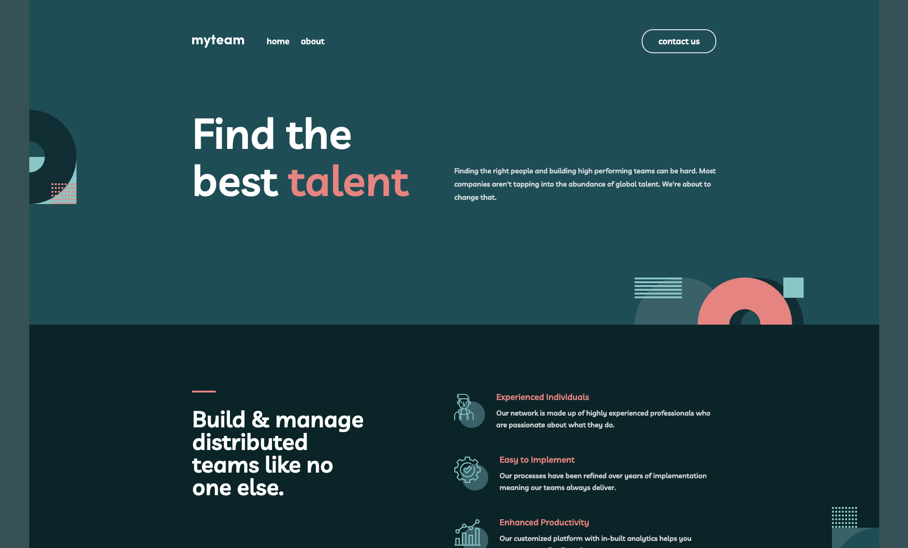

# myteam Website (Frontend Mentor)

This is my personal solution to the [myteam website challenge on Frontend Mentor](https://www.frontendmentor.io/challenges/myteam-multipage-website-mxlEauvW). Frontend Mentor challenges help you improve your coding skills by building realistic projects.

## Overview

### The challenge

**myteam** is a startup created by Nikita Marks, Cristian Duncan and Cruz Hamer to help companies build and improve their teams.

The specifications for the website are as follows. The users should be able to:

- View the optimal layout for each page depending on their device's screen size
- See hover states for all interactive elements throughout the site
- See the correct content for each team member on the About page when the `+` icon is clicked
- Receive an error message when the contact form is submitted if:
  - The `Name`, `Email Address` or `Message` fields are empty should show "This field is required"
  - The `Email Address` is not formatted correctly should show "Please use a valid email address"

### Screenshot

### Links

- Solution URL: [GitHub](https://github.com/jakegodsall/fm-myteam-website)
- Live Site URL: [Vercel](https://fm-myteam-website.vercel.app/)

## My process

### Built with

- [React](https://reactjs.org/) - JS library
- [Next.js](https://nextjs.org/) - React framework
- [Framer Motion](https://www.framer.com/motion/)

### Useful resources

- [How to Create 3D Flipping Animation on a Box/Card with CSS
  ](https://www.w3docs.com/snippets/css/how-to-create-a-3d-flipping-animation-on-a-box-card-with-css.html) - This helped me to implement the card flipping behaviour on the _About_ page.

## Author

- Website - [Jake Godsall](https://jakegodsall.com)
- Frontend Mentor - [@jakegodsall](https://www.frontendmentor.io/profile/jakegodsall)
- LinkedIn - [@godsalljake](https://www.linkedin.com/in/godsalljake/)

## License

This project is open source and available under the [MIT License](./LICENSE).
